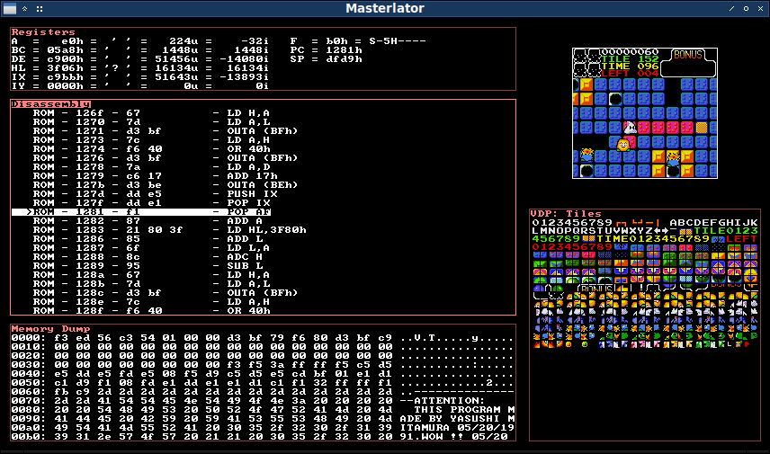
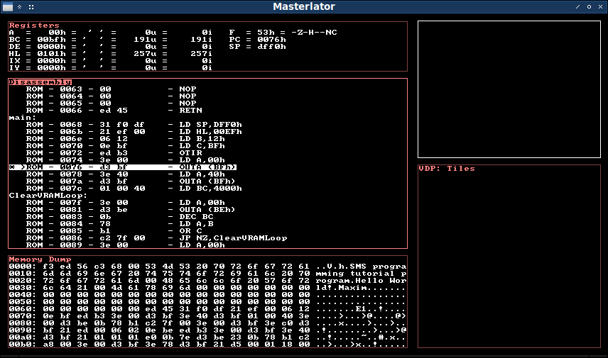

Masterlator
===========

This is a Sega Master System and Game Gear emulator and debugger written in C++ and using the SDL2 library. It can be used both for gaming and as a development tool for homebrew software development for the Sega Master System and Game Gear. For this purpose, Masterlator supports wla-dx compatible symbol (*.sym) files.

## Copyright & License

Masterlator is free software and licensed under GPL-3.0.

Copyright (c) 2001-2024 by Christian Nowak a.k.a. chn

## Cloning from git and compilation

    git clone https://github.com/chn-dev/MasterlatorSDL
    cd MasterlatorSDL
    cmake . -B build
    cmake --build build

## Overview

The simplest way Masterlator can be is by passing a ROM file name via the "-r" command line option:

  Masterlator -r /path/to/rom.sms

This loads and runs the specied ROM image in windowed mode. Masterlator autodetects and uses any joypads connected to your system. If no joypad is detected, the keyboard can be used instead. The default keyboard mapping is:

  - Return: Start Button
  - Y: A Button
  - X: B Button
  - Cursor Keys: DPAD

### Command Line Parameters

Masterlator accepts the following command line options:

  - --rom /path/to/ROMFILE (-r): Specifies the ROM file
  - --width WIDTH (-dx): Width of the viewport in pixels or in multiples of emulated system screen width (example: --width x2)
  - --height HEIGHT (-dy): Height of the viewport in pixels or in multiples of the emulated system screen height (example: --height x4)
  - --keepar (-k): Keep aspect ratio
  - --fullscreen (-f): Fullscreen mode
  - --maximized (-m): Maximized window
  - --startkey SDLKEY (-sk): Define the keyboard key for the Start button
  - --akey SDLKEY (-ak): Define the keyboard key for the A button
  - --bkey SDLKEY (-bk): Define the keyboard key for the B button
  - --upkey SDLKEY (-sk): Define the keyboard key for the Up DPAD button
  - --downkey SDLKEY (-dk): Define the keyboard key for the Down DPAD button
  - --leftkey SDLKEY (-lk): Define the keyboard key for the Left DPAD button
  - --rightkey SDLKEY (-rk): Define the keyboard key for the Right DPAD button
  - --debug (-d): Enable the debugger
  - --sym /path/to/SYMFILE (-s): Load a wla-dx compatible symbol file

SDLKEY names are SDL compatible, as accepted by the SDL_GetKeyFromName() function.

If no symfile is given using the --sym (-s) parameter Masterlator automatically tries to load a symbols file by replacing the ".sms" or ".gg" suffix of the ROMFILE with ".sym". Breakpoints are supported.

### The Debugger

The debugger can be enabled using the "-d" or "--debug" command line option. In that case, when starting up, the emulator will break into the debugger right before executing the first Z80 machine instruction, i.e. at address 0x0000. You can then press F5 to run the ROM normally. The emulator will then break only when it hits a breakpoint:

The debugger consists of 4 sections (beside the main screen output):

  - Registers
  - Disassembly
  - Memory Dump
  - VDP

You can cycle through the sections with the (Shift+)TAB key. By default and in the screenshot above, the disassembly section is activated.

#### Disassembly

The inversed line designates the position of the cursor. The current PC (program counter) position of the Z80 CPU is marked with a ">" character at the beginning of the line. The "*" character designates a breakpoint.

Key mapping:

  - Cursor Up/Down and PageUp/PageDown: move the cursor
  - Space Bar: toggle a breakpoint at the current cursor position
  - Home: Move the cursor to the current PC of the Z80 CPU
  - F5: Run emulation until it hits a breakpoint
  - F10: Step over
  - F11: Step into

#### Registers

The inversed line designates the currently selected register.

Key mapping:

  - Cursor Up/Down/Left/Right: Move the cursor and thereby change the currently selected register
  - 0-9,a-f: Change the currently selected register's hexadecimal value

#### VDP

This section shows either all tiles in VRAM or information about all 64 sprites: (x/y positions and the tile)

Key mapping:

  - Cursor Left/Right: Cycle between tile display and sprite information

#### Memory Dump

The memory dump shows the contents of the Z80's 16bit address space in hexadecimal form and its ASCII representation.

Key mapping:

  - Cursor Up/Down, PageUp/PageDown: Navigation, changes the base address.
  - Cursor Left/Right: Changes the way the visible address space is calculated.
     - Absolute: 1234h (=base address)
     - BC-relative: BC+1234h
     - DE-relative: DE+1234h
     - HL-relative: HL+1234h
     - IX-relative: IX+1234h
     - IY-relative: IY+1234h
     - SP-relative: SP+1234h
     - PC-relative: PC+1234h

## That's it!

If you have any questions, comments, suggestions or just wanna say hi, feel free to contact me.

Christian Nowak a.k.a. chn <[chnowak@web.de](mailto:chnowak@web.de)>

[https://mastodon.art/@chn/](https://mastodon.art/@chn/)

[https://github.com/chn-dev/](https://github.com/chn-dev/)

[https://www.chn-dev.net/](https://www.chn-dev.net/)
